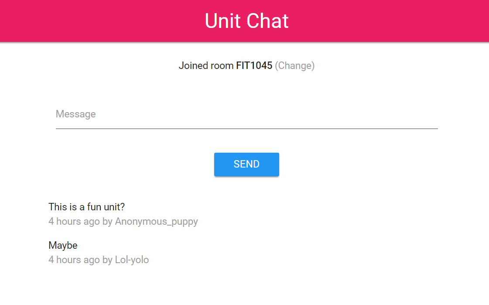
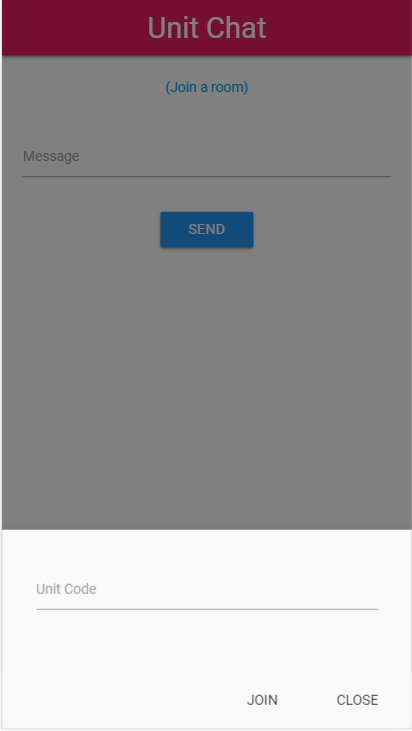
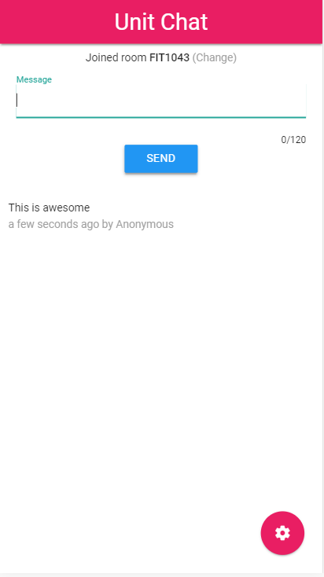
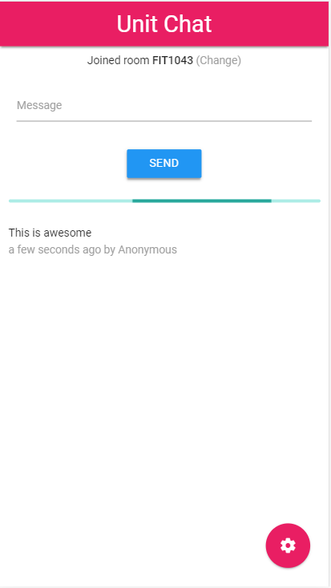
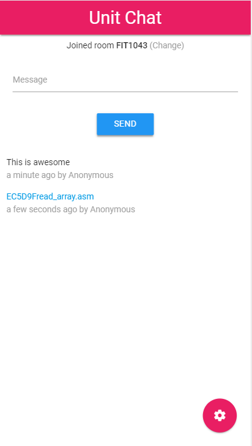

# Monash-Unit-Chat
Chat with others studing the same unit to rant, range and share memes about inside jokes for the unit.

## About
This tool is made so that people studying the same unit can talk to each other. It is independent of the University, unlike Moodle forums.

## Features
* Anonymously connect with unit mates
* Upload files
* Backup chats for later reference

## Rules
* There may be imposed limits on messages per day.
* Messages may be deleted to keep this service free.
